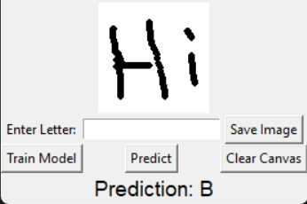

# SingleLetterRecognizing

**SingleLetterRecognizing** is a computer vision project designed to recognize single handwritten letters from images. Leveraging Python and machine learning, this project demonstrates an end-to-end pipeline for preprocessing, training, and deploying a model to classify alphabetic characters accurately. Built as a personal exploration into AI and image processing. 

# Demo
[](https://www.youtube.com/watch?v=WxMTm0kl-Hc)

## Features
- **Handwritten Letter Recognition**: Identifies single letters (A-Z) from grayscale images.
- **Custom Model**: Trained on a curated dataset of handwritten letters for robust performance with ANN and CNN.

## Getting Started

### Prerequisites
- Python 3.8+
- Required libraries: `opencv-python`, `glob` (install via `pip install -r requirements.txt`)
- A compatible dataset (e.g., handwritten letter images in PNG format)

### Installation
1. Clone this repository:
   ```bash
   git clone https://github.com/mingyanying/SingleLetterRecognizing.git
   cd SingleLetterRecognizing
